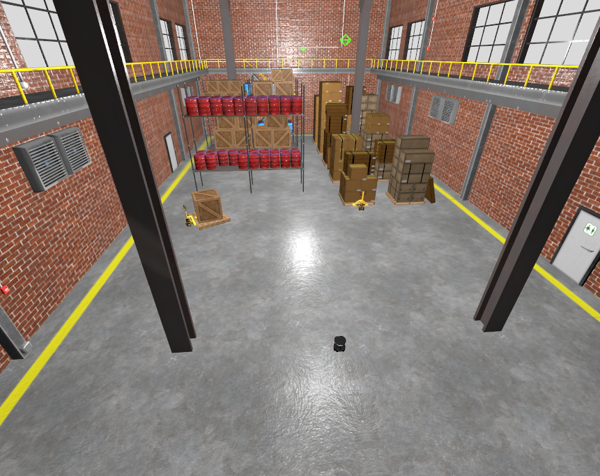

# Turtlebot4 MPC Simulation

This is a repository aims to simulate the Turtlebot4 robot for use with Nav2 and custom MPC controller.


<!-- [] -->


### Dependencies
...

## Launch
...
<!-- ```
ros2 launch mpc_ros2 mpc_planner.launch.py
``` -->

## TODO
...


